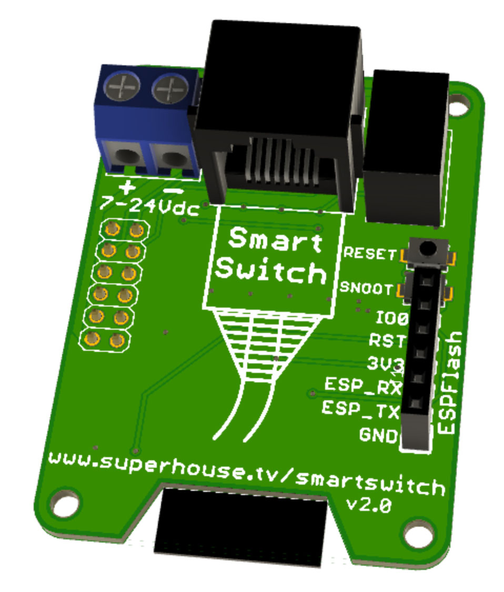

SuperHouse Home Automation SmartSwitch
=======================================

Home automation light switch that can be constructed with different
button panels, all using the same logic board. This allows the same
logic board and software to be used for either single-colour or RGB
button panels, in sizes from 1 to 4 buttons.

The switch can either operate in isolation using WiFi and local power,
or it can connect to a central light switch controller via Cat-5
cable.

It's designed to mount in a standard Australian blank wall plate,
but can also fit other types of wall plate.

Features:

 * ESP8266 with WiFi
 * RJ45 socket to allow connecting using Cat-5 cable.
 * Either single-colour or RGB buttons.
 * From 1 to 4 buttons per panel.
 * WS2811 LED controllers.

More information is available at:

  https://www.superhouse.tv/smartswitch

Hardware
--------
The "Hardware" directory contains the PCB design as an EAGLE project.
EAGLE PCB design software is available from Autodesk free for
non-commercial use.

Credits
-------
 * Jonathan Oxer <jon@oxer.com.au>

License
-------
Copyright 2014-2020 SuperHouse Automation Pty Ltd  www.superhouse.tv  

The hardware portion of this project is licensed under the TAPR Open
Hardware License (www.tapr.org/OHL). The "license" folder within this
repository contains a copy of this license in plain text format.

